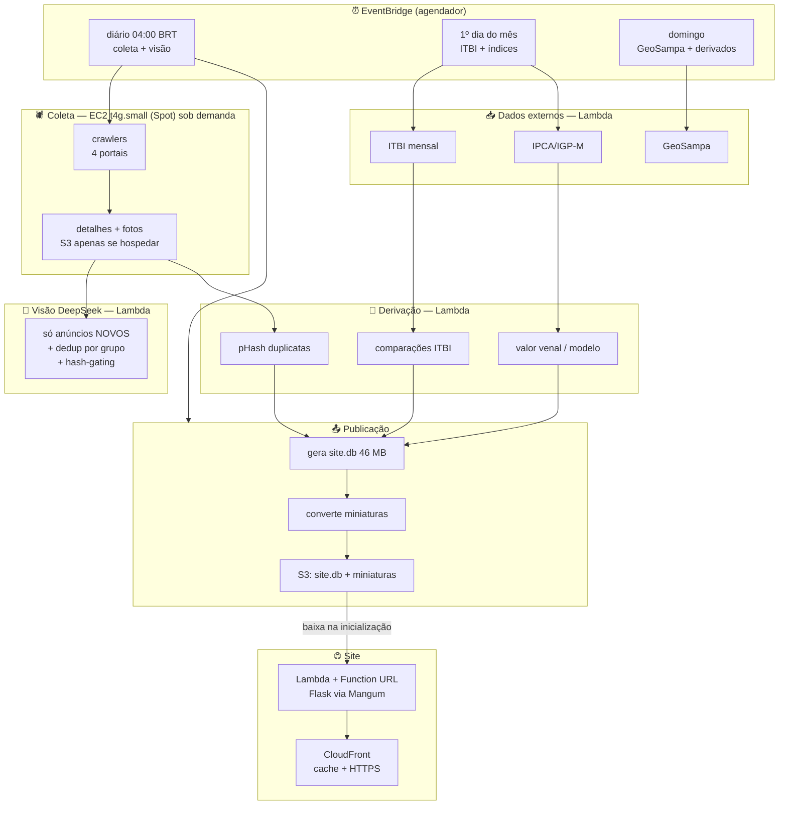

# Plano de deploy na AWS (free tier) + atualização automática

> **Método:** todo número deste documento foi **medido no banco, na rede ou no
> código** — não deduzido. Onde não deu para medir, está escrito *estimado*.
> Scripts usados: `sonda_fontes.py`, `medir_deploy.py`, `medir_site_db.py`,
> `custo_visao.py`.

---

## Resumo executivo

| Pergunta | Resposta medida |
|---|---|
| Cabe no free tier da AWS? | **Sim**, e com folga — desde que o site sirva um banco de **46 MB**, não os 638 MB |
| O "R$ 30" do DeepSeek de onde vem? | **Todas as fotos + `detail: original` = R$ 29,04.** É o cenário mais caro possível |
| Dá para rodar o mesmo por muito menos? | **Sim: R$ 12,43** (1× por grupo de duplicata, `detail: low`). E a atualização diária custa **centavos** |
| O crawler está na legalidade? | **Parcialmente.** O `Crawl-delay: 10` do ZAP/VivaReal é ignorado hoje — isso precisa mudar |
| Pode publicar o site com esses dados? | **Sim, com ressalvas pontuais.** O risco não é LGPD (não há dado pessoal) — é **direito autoral das fotos e dos textos** |
| O pipeline já está pronto? | **Não.** Existe o coletor, mas falta a camada de agendamento, retomada e controle de custo |

---

## 1. Números medidos

### 1.1 Tamanhos (o que decide a arquitetura)

```
banco de trabalho  imoveis.db    637,8 MB   163.276 páginas de 4 KB
fotos                           5.031,2 MB   57.451 arquivos (média 93 KB)
playwright-profile                101,5 MB
html_ponte                         74,2 MB
```

O `imoveis.db` parece grande, mas **o site não lê quase nada dele**:

| tabela | linhas | quem usa |
|---|---|---|
| `lotes` | 1.627.266 | **só o cálculo** — o site nunca lê |
| `itbi` | 537.354 | **só o cálculo** — o site nunca lê |
| `fotos` | 57.402 | site |
| `cep_da_rua` | 26.660 | cálculo |
| `comparacoes_detalhe` | 17.599 | site |
| `anuncios` | 4.793 | site |
| `valores_venais` | 4.793 | site |
| `areas_oficiais` | 3.163 | site |
| `comparacoes` | 3.155 | site |

**Testado, não estimado:** gerei um `site.db` só com o que a tela lê e com os
índices que ela precisa (`idx_fotos_anuncio`, `idx_comp_anuncio`,
`idx_val_anuncio`, `idx_area_anuncio`, `idx_det_anuncio`, `idx_anuncios_preco`,
`idx_anuncios_bairro`):

```
imoveis.db (trabalho)   637,8 MB
site.db    (produção)    46,3 MB   <- 13,8x menor
```

> Sem esses índices a home levava **213 s** (medido numa sessão anterior:
> 44,5 ms × 4.793 cards varrendo `fotos`). Eles são obrigatórios, não opcionais.

### 1.2 Custo de tokens da análise visual

Parâmetros **medidos** (não estimados): `detail: low` = 203 tok/imagem ·
`detail: original` = 458 · prompt ≈ 907 tok · saída ≈ 265 tok.
Preço `deepseek-flash` (US$/1M): entrada 0,30 peak / **0,15 off-peak**;
saída 1,20 peak / **0,60 off-peak**. Off-peak = 01–04h e 06–10h UTC, seg–sex.

Estado atual do código: `VISAO_DETALHE = "original"` e **`VISAO_MAX_FOTOS = 0`
(sem teto)** — ou seja, envia **todas** as fotos. Matriz para a base inteira
(4.793 anúncios, 57.402 fotos):

| cenário | US$ | R$ |
|---|---|---|
| TODAS as fotos, `original`, peak | 10,72 | 58,08 |
| **TODAS as fotos, `original`, off-peak** | **5,36** | **29,04** ← o "R$ 30" |
| TODAS as fotos, `low`, peak | 6,32 | 34,28 |
| TODAS as fotos, `low`, off-peak | 3,16 | 17,14 |
| teto 12 fotos, `original`, off-peak | 5,37 | 29,08 |
| teto 12 fotos, `low`, off-peak | 3,17 | 17,16 |
| teto 8 fotos, `low`, off-peak | 2,58 | 13,99 |
| **1× por grupo de duplicata, `low`, off-peak** | **2,29** | **12,43** |

**Onde está o desperdício** — a cauda de fotos:

```
  1-5 fotos    1.907 anúncios (42,0%)  ##################
  6-12           853 anúncios (18,8%)  ########
  13-25        1.159 anúncios (25,6%)  ###########
  26-50          543 anúncios (12,0%)  #####
  51+             74 anúncios ( 1,6%)
  media 12,7 · mediana 12 · p90 30 · p99 57 · MÁXIMO 135
```

60% dos anúncios têm ≤12 fotos, mas **14% têm mais de 25** — e é aí que o
dinheiro vai. Um teto de 12 não muda quase nada na conta do `detail: original`
(R$ 29,04 → R$ 29,08, porque o prompt domina), mas **corta 45% das fotos**.

**Fotos repetidas:** 57.402 linhas, 56.263 URLs distintas — só **2,0%** são
repetição literal. A economia grande **não** vem de deduplicar URL: vem de
**analisar 1× por grupo de duplicata** (2.938 imóveis distintos em vez de 4.793
anúncios), o que leva a 46.865 fotos em vez de 56.263.

> Nota de método: uma contagem por **nome de arquivo** acusa 44.311 repetições
> — é falso. O QuintoAndar usa `image.jpg` como nome genérico e põe o ID no
> **diretório** (`895323426-897.5243673517473image.jpg`). Contar por nome
> apontaria uma economia de 77% que não existe. Contar por URL é o correto.

### 1.3 Latência e cadência real de cada fonte

| fonte | resposta | cadência | o que muda |
|---|---|---|---|
| IBGE IPCA (agregado 1737) | 0,2 s | **mensal** | fator de correção |
| BCB SGS 189 (IGP-M) | 0,6 s | **mensal** | fator de correção |
| GeoSampa WFS | 0,4 s | **diária** | área oficial do lote |
| ITBI (Fazenda) | ✅ `descobrir_links()` acha **21 anos (2006–2026)** | **mensal** | preço praticado |
| Portal dados abertos (CKAN) | **falha intermitente** | — | requer retry |

> O `itbi.py` **já está no endereço certo**: a página antiga (`/20706`) dá 404 e
> a nova (`/31501`) responde. `descobrir_links()` devolve os 21 anos. Não há
> nada a consertar aqui.

### 1.4 Tráfego das fotos (decide se o free tier aguenta)

Amostra de 12.001 fotos: **média 93 KB**, mediana 87 KB, p90 146 KB.

Página com 60 cards × 1 foto de capa = **5,5 MB por carregamento**.

| limite | visitas de página que cabem |
|---|---|
| 1 TB/mês (CloudFront free tier) | **191.728** |
| 100 GB/mês (limite de saída da EC2) | 18.723 |

**O free tier aguenta.** 190 mil páginas/mês é muito mais do que este site vai
ver. Mas 5,5 MB por página é ruim para o usuário em 4G — e miniatura resolve
os dois: com 35 KB/foto, a página cai para 2,1 MB e cabem **511 mil** visitas.

---

## 2. Legalidade — leia antes de publicar

### 2.1 robots.txt: o que cada portal efetivamente autoriza

Medido em 2026-10-05:

| portal | HTTP | `Crawl-delay` | achado relevante |
|---|---|---|---|
| **Imovelweb** | 200 | nenhum | libera a busca; bloqueia só `?utm_*`, `?duplicated=*`, `?labs=*` |
| **OLX** | **403** | — | **não consigo ler o robots.txt** — o anti-bot bloqueia a própria leitura |
| **ZAP** | 200 | **`10`** | declarado para `*` |
| **VivaReal** | 200 | **`10`** | declarado para `*` |
| **QuintoAndar** | 200 | nenhum | libera a busca; bloqueia `/imovel/*/descricao`, `/detalhes-imovel`, `/agendar` |

### 2.2 As três exposições reais

**1. `Crawl-delay: 10` ignorado (ZAP e VivaReal).**
É uma instrução explícita do dono do site, no arquivo que existe exatamente
para isso. Hoje o coletor paraleliza (8 threads / `VISAO_PARALELO=10`) e passa
longe de 10 s entre requisições. **Isto é o item mais fácil de corrigir e o
mais difícil de justificar não corrigir.**

**2. Direito autoral dos TEXTOS.**
Descrições de anúncio são obra protegida (Lei 9.610/98, art. 7º). Reproduzir a
íntegra num site público é redistribuição. Medido: **131 anúncios têm descrição
preenchida, 71 acima de 500 caracteres, máximo 3.849**. A exposição é pequena
em volume, mas existe.

**3. Direito autoral das FOTOS — o maior risco.**
5 GB de fotos de 57 mil arquivos, de imobiliárias distintas. Foto é obra
protegida. Baixar para análise local é uma coisa; **servir num site público é
outra**, porque aí você é quem redistribui. É o item com maior probabilidade de
gerar reclamação (as imobiliárias monitoram uso das próprias fotos).

### 2.3 LGPD: verificado, NÃO é o problema

Procurei dado pessoal no banco:

- **Colunas de `anuncios`:** nenhuma de corretor, telefone, e-mail, contato,
  anunciante, imobiliária ou CRECI. As 49 colunas são de imóvel, foto e
  duplicata.
- **Nas descrições (amostra de 131):** **0 com telefone, 0 com e-mail.**

Ou seja: o dado é sobre **imóveis** (endereço, preço, área), publicamente
anunciados. Risco de LGPD é baixo. Há uma nuance a registrar: *endereço de
imóvel + "à venda"* pode indiretamente indicar que uma pessoa está vendendo —
mas como o dado já era público no anúncio original, não há tratamento novo de
dado pessoal.

### 2.4 Recomendações concretas

| # | medida | custo | efeito |
|---|---|---|---|
| 1 | **Respeitar `Crawl-delay: 10`** no ZAP/VivaReal: 1 requisição a cada 10 s, sem paralelismo nesses dois | alonga a coleta | remove a exposição mais clara |
| 2 | **Linkar as fotos, não copiar** (``) | zero | deixa de redistribuir; **derruba os 5 GB do S3** |
| 3 | **Não reproduzir a descrição integral** — mostrar resumo curto + link "ver no portal" | baixo | respeita o art. 8º (citação para fins informativos) |
| 4 | **`User-Agent` honesto** identificando o projeto, com URL de contato | baixo | é o que o `robots.txt` presume |
| 5 | **`robots.txt` próprio** bloqueando indexação do site | baixo | evita que o conteúdo replicado apareça em busca |
| 6 | **Página de remoção** (*takedown*): "se você é o autor e quer remover, escreva para X" e **atender em 48 h** | baixo | reduz muito o risco prático |
| 7 | **`noindex, nofollow`** nas páginas de detalhe | baixo | tira o site do radar de busca |
| 8 | Manter a análise visual **local/privada**; publicar só o **agregado** ("tem quintal: sim"), não a foto | zero | o dado derivado é seu |

### 2.5 O que NÃO fazer

- **Não** criar uma versão "pública de verdade" com as fotos hospedadas se a
  intenção é divulgar. Se for só para uso próprio, mantenha privado (login) e a
  análise toda muda de figura.
- **Não** contornar o 403 da OLX com proxy/rotação de IP. Isso é o que
  transforma "coleta de dado público" em "evasão de medida técnica", que é
  agravante, não atenuante.
- **Não** republicar a descrição integral nem o nome/telefone do corretor se um
  dia isso entrar na base.

> **Aviso honesto:** não sou advogado e isto não é parecer jurídico. É a leitura
> dos fatos técnicos medidos. Antes de abrir o site ao público, vale uma
> consulta — a exposição principal (fotos) tem solução técnica simples
> (linkar em vez de copiar), que já elimina a maior parte do risco sem custo.

---

## 3. Arquitetura recomendada

### 3.1 A decisão que muda tudo: `site.db` de 46 MB

Com 46 MB, **SQLite é a escolha certa** e todo o resto simplifica:

- cabe no `/tmp` do Lambda (512 MB–10 GB) com folga;
- o deploy é **copiar um arquivo**, não migrar dados;
- não há banco gerenciado para pagar;
- leitura é local (sem latência de rede por consulta).

### 3.2 Diagrama



### 3.3 Por que não as alternativas óbvias

| alternativa | por que não |
|---|---|
| **RDS** | o free tier de RDS é **12 meses, não "sempre grátis"**. E 46 MB não precisa de banco gerenciado |
| **DynamoDB** | o motor do site é SQL com `JOIN`/`LIKE` em SQLite. Reescrever tudo para NoSQL é semanas de trabalho por zero de benefício em 46 MB |
| **ECS/Fargate** | sem free tier real (0,5 GB·h não cobre um serviço rodando 24/7) |
| **Lambda com Playwright** | o pacote Chromium não cabe nos 250 MB do zip. Por isso a coleta fica em **EC2 Spot**, não em Lambda |
| **EventBridge Scheduler "grátis"** | são 14 milhões de invocações grátis, mas **agendamentos têm cobrança própria** (~US$ 0,01/dia por schedule ≈ R$ 1,60/mês cada). Com 3 schedules, ~R$ 5/mês. *Valor a confirmar no console* |

---

## 4. Economia de tokens

### 4.1 Onde o dinheiro está indo

No cenário de R$ 29,04:

- **entrada: quase tudo.** 57.402 fotos × 458 tok = 26,3M tokens de imagem,
  contra 4,3M do prompt. A foto domina.
- **`detail: original` custa 2,26× o `low`** (458 vs 203 tok).
- **a cauda de fotos custa caro:** 14% dos anúncios têm >25 fotos.
- **60% da base é anúncio duplicado** (2.857 de 4.793): **a mesma casa é
  analisada até 25 vezes.**

### 4.2 As alavancas, ordenadas por ganho

| # | alavanca | ganho | risco |
|---|---|---|---|
| 1 | **Analisar 1× por grupo de duplicata** (reaproveitar a análise do principal) | R$ 29,04 → **R$ 12,43** (−57%) | nenhum — já é o que `analisar_visual.py` faz no comentário, mas não na prática |
| 2 | **`detail: low`** em vez de `original` | −41% na entrada | **perde detalhe fino** (mofo, rachadura). Foi o motivo de usar `original` |
| 3 | **Off-peak sempre** (01–04h e 06–10h UTC) | −50% | nenhum, só agendar |
| 4 | **Teto de fotos** (`VISAO_MAX_FOTOS`) + amostragem | corta 45% das fotos | já existe `_amostrar_fotos`; a ordem da galeria põe quintal no fim, então a amostragem **é melhor** que as N primeiras |
| 5 | **Não reanalisar o que já foi analisado** | essencial no diário | nenhum |
| 6 | **Deduplicar foto por hash local** antes de enviar | 2% literal | pouco ganho — **não vale** o esforço |

**Recomendação:** ligar 1, 3, 4 e 5 agora (risco zero, leva de R$ 29,04 para
~R$ 12). Deixar o `detail` como está até **medir** `low` vs `original` num
conjunto com verdade conhecida — o comentário do código já avisa que nunca foi
comparado.

### 4.3 Guard-rails (o que impede o gasto descontrolado)

O ponto cego hoje é que **a cobertura medida é de 38% (1.829 de 4.793)** e não
há registro de quando cada anúncio foi analisado *com qual configuração*. Isso
já causou: a base cresceu de 178 para 4.793 e ninguém percebeu que a análise
ficou para trás.

Proposta — tabela `visao_ledger` (controle de custo e idempotência):

```sql
CREATE TABLE visao_ledger (
  anuncio_url  TEXT,
  modelo       TEXT,      -- deepseek-flash
  detalhe      TEXT,      -- low | original
  n_fotos      INTEGER,
  tok_entrada  INTEGER,
  tok_saida    INTEGER,
  usd          REAL,
  executado_em TEXT,
  PRIMARY KEY (anuncio_url, modelo, detalhe, n_fotos)
);
```

- **Chave primária composta** = rodar de novo não repaga o mesmo anúncio com a
  mesma configuração.
- Trocar de `low` para `original` **conta como trabalho novo** (é legítimo), mas
  fica registrado e comparável.
- Um `SELECT SUM(usd) WHERE executado_em > ...` mostra o gasto do dia, e o
  pipeline **aborta** se passar de um teto (`VISAO_ORCAMENTO_USD`).

---

## 5. Os pipelines

### 5.1 Cadência por tipo de dado

| dado | cadência | por quê | custo diário medido |
|---|---|---|---|
| **anúncios + fotos** | **diário** | preço/estoque mudam todo dia; é o valor do produto | 0 |
| **análise visual** | diário, **só novos** | acompanha os anúncios | 20 novos = **R$ 0,11–0,22**; 100 novos = R$ 0,57–1,09 |
| **ITBI** | **mensal** | a prefeitura publica por mês (medido: 21 anos disponíveis, arquivo novo mensal) | 0 |
| **IPCA / IGP-M** | **mensal** | o índice muda uma vez por mês | 0 |
| **GeoSampa (lotes)** | **domingo** (semanal) | o cadastro muda devagar; baixar 1,6M de lotes é caro em banda | 0 |
| **pHash + duplicatas** | diário, **só o delta** | anúncio novo pode duplicar um antigo; não precisa reprocessar tudo | 0 |
| **comparações ITBI + venal** | **após** ITBI e após os anúncios | é derivado dos dois | 0 |
| **site.db** | **após qualquer um acima** | publica o resultado | 0 |
| **miniaturas** | diário, só fotos novas | alimenta o site | 0 |

**A resposta ao "os outros dados precisam ver a latência":** só os **anúncios**
precisam ser diários. ITBI e índices são **mensais por natureza da fonte** —
rodar diário não traria dado novo e só gastaria banda. GeoSampa é semanal.

### 5.2 Estágio 0 — Coleta (EC2 Spot)

Ordem por bairro, respeitando `crawl-delay`:

```
para cada bairro em config.BAIRROS:
    crawler do portal  ->  upsert por URL (chave primária, nunca duplica)
```

- **Retomada obrigatória:** cada etapa grava seu progresso; interromper e rodar
  de novo não refaz trabalho. O projeto já faz isso em `baixar_fotos` e
  `ingerir_itbi` — replicar nos outros.
- **Rate limit é real:** medido anteriormente, a OLX bloqueia por horas após
  ~60 páginas. Lotes de ~50 com pausa.
- **Ponto de quebra:** o `playwright-profile/` (101 MB) guarda cookies. Num
  servidor isso precisa de disco persistente — por isso EC2 e não Lambda.

### 5.3 Estágio 1 — Normalização (Lambda)

Tudo o que não gasta API:

```
herdar_endereco.py      (consenso de rua/CEP dentro do grupo — custo zero)
endereco.py             (chave_tolerante, normalizar_cep)
tipo_do_anuncio()       (descarta apartamento)
```

**Determinístico e idempotente.** Rodar 10× dá o mesmo resultado.

### 5.4 Estágio 2 — Visão (Lambda) — *o estágio que gasta*

```
selecionar anúncios onde:
    foto_analisada_em IS NULL
    OU (modelo/detalhe/n_fotos) mudou em relação ao ledger
ordenar do mais recente para o mais antigo
agrupar por dup_grupo, analisar só o PRINCIPAL, propagar para as cópias
respeitar VISAO_MAX_FOTOS (teto) e VISAO_AMOSTRAGEM
rodar em off-peak (01-04h / 06-10h UTC)
abortar se SUM(usd) do dia > VISAO_ORCAMENTO_USD
```

**Idempotência pelo `visao_ledger`** — é o que impede o gasto repetido.

### 5.5 Estágio 3 — Dados externos (Lambda)

| tarefa | cadência | cuidado |
|---|---|---|
| `itbi.py` → `descobrir_links()` → baixar | mensal | a URL muda de mês em mês; a função resolve, mas **testar a cada mês** |
| `ingerir_itbi.py` | após o download | mapeia colunas **por nome** (2006 tem layout diferente) |
| `indices.py` (IPCA; IGP-M agora disponível) | mensal | cachear em `dados/indices.json` |
| `baixar_cadastro.py --completar` | semanal | retomar pelos blocos finais (senão regasta 13 min) |

### 5.6 Estágio 4 — Derivação (Lambda)

```
achar_duplicatas.py --marcar      (com a trava de 2+ ruas / 2+ bairros)
comparar_itbi.py --refazer        (preenche area_terreno também)
valor_venal.py                    (razão por região)
```

> **Ordem importa:** `pHash` **antes** de `comparar_itbi`, porque a comparação
> aproveita a herança de endereço que o pHash destrava.

### 5.7 Estágio 5 — Publicação (Lambda)

```
1. gerar site.db  (só as 6 tabelas da tela + os 7 índices)   -> 46 MB
2. converter miniaturas 400px das fotos novas
3. subir site.db e miniaturas para o S3
4. invalidar o cache do CloudFront
```

O site baixa o `site.db` na inicialização (cold start) ou o mantém em `/tmp`.

---

## 6. AWS: limites e custos

### 6.1 Mapa de serviços

| serviço | para quê | free tier | nosso uso |
|---|---|---|---|
| **Lambda** | site, visão, dados externos, derivação | 1M req + 400.000 GB·s/mês | folgado |
| **S3** | `site.db` (46 MB) + miniaturas (~349 MB se gerar) | 5 GB + 20.000 GET / 2.000 PUT | cabe |
| **CloudFront** | cache, HTTPS, CDN | 1 TB + 10M req/mês | cabe (medido: 191k páginas cheias) |
| **EventBridge** | agendador | invocações grátis | ⚠️ schedules podem ter custo (~R$ 1,60/mês cada) |
| **EC2 t4g.small** | coleta (precisa de Chromium + disco) | **750 h/mês de t2/t3.micro até 2025** | ⚠️ ver 6.2 |
| **ECR / logs** | imagens, CloudWatch | 500 MB logs | vigiar |

### 6.2 Limites que apertam — conferir no console

Estas três **mudaram recentemente e não consegui confirmar na documentação**.
São as que decidem o custo real:

1. **O free tier de EC2 de 750 h/mês é válido só para `t2.micro`/`t3.micro`** —
   a família `t4g` (ARM, mais barata) pode não estar coberta. Uma `t3.micro`
   com Chromium faz a coleta, mas com pouca memória (1 GB).
2. **O free tier de 12 meses x "sempre grátis":** Lambda/S3/CloudFront são
   "sempre grátis"; EC2 e RDS são **só nos primeiros 12 meses**. O plano não
   depende de RDS, mas depende de EC2.
3. **Cobrança de schedule** no EventBridge Scheduler.

**Mitigação se o EC2 sair do free tier:** a coleta roda **sob demanda**, não
24/7. Uma `t3.small` Spot por ~1 h/dia custa na casa de **US$ 1–3/mês**
(~R$ 5–16). Continua dentro do "até R$ 20".

### 6.3 Custos fora do free tier (estimados)

| item | estimativa |
|---|---|
| EC2 Spot, 1 h/dia | R$ 5–16/mês |
| EventBridge, 3 schedules | ~R$ 5/mês |
| CloudWatch Logs (retenção 7 dias) | < R$ 2/mês |
| Tráfego de saída da EC2 (não via CloudFront) | variável — **manter tudo atrás do CloudFront** |
| Domínio (opcional) | ~R$ 40/ano (.com.br) |
| **DeepSeek, base inteira uma vez** | **R$ 12,43** (com as alavancas) |
| **DeepSeek, manutenção diária** | **R$ 3–17/mês** (20–100 novos/dia) |

**Total realista: R$ 25–45/mês**, sendo a maior parte o DeepSeek — **não** a AWS.
Isso responde a preocupação central: a AWS não é o custo dominante; o
processamento de imagem é, e ele é controlável.

---

## 7. Estratégia de branches

### 7.1 Regra

> `master` **só recebe o que passou por verificação**. Nada entra direto.
> Cada branch tem um critério objetivo de saída (testes passando, número
> medido, revisão legal) — não "acho que está pronto".

### 7.2 As branches e o que entra em cada uma

Ordem importa: as primeiras produzem os *helpers* que as seguintes reusam.

| # | branch | conteúdo | critério de saída |
|---|---|---|---|
| 1 | **`chore/limpeza-raiz`** | mover os ~35 scripts soltos da raiz (o padrão do projeto é atalho de 2 linhas + `src/`); tirar os 3 `.db` de backup do disco; ampliar o `.gitignore` para `saida_*.txt`, `custo.txt`, `deploy.txt`, `site_db.txt`, `sonda.txt` | `git status` limpo, testes passando, raiz com ≤ ~15 arquivos |
| 2 | **`plano/deploy-aws`** | este documento + `sonda_fontes.py`, `medir_deploy.py`, `medir_site_db.py`, `custo_visao.py` | plano revisado por você |
| 3 | **`feat/visao-custo`** | `VISAO_MAX_FOTOS` ≠ 0, `VISAO_ORCAMENTO_USD`, tabela `visao_ledger`, 1× por grupo, agendamento off-peak | rodar em 50 anúncios e **medir** US$ gasto ≈ previsto |
| 4 | **`dados/indice-igpm`** | corrigir a memória do projeto (o IGP-M **funciona**; o "NXDOMAIN" era certificado self-signed), `indices.py` com escolha de índice | dispersão intrarrua ≤ a do IPCA (já medido: 17,4% vs 18,6%) |
| 5 | **`feat/pipeline-diario`** | scripts agendáveis, retomada, `config.CADENCIA`, EventBridge | rodar 3 dias seguidos sem intervenção |
| 6 | **`feat/site-publico`** | `LinkSource` (linkar CDN em vez de copiar), **truncar descrição** + link "ver no portal", `robots.txt` + `noindex`, página de *takedown*, miniaturas 400px | revisão legal + `site.db` < 50 MB + página < 2,5 MB |

### 7.3 Como fazer o merge

```bash
# 1. parte de master atualizada
git checkout master && git pull

# 2. branch curta, com um assunto só
git checkout -b feat/visao-custo

# 3. commits pequenos -- um por mudança lógica, não um commit gigante
# 4. antes de abrir o PR, rebase (não merge) para o histórico ficar linear
git rebase master

# 5. valide ANTES de subir
.\.venv\Scripts\python.exe tests\testar_web.py
.\.venv\Scripts\python.exe tests\testar_tipo.py

# 6. só então empurra a branch
git push -u origin feat/visao-custo
# 7. merge em master (squash) somente depois do critério de saída cumprido
```

### 7.4 Estado atual do repositório (medido)

```
branch: master (limpa, sincronizada com origin/master)
96 arquivos rastreados · .git = 0,86 MB · nenhum segredo publicado
8 arquivos NÃO rastreados na raiz:

  conferir_todos.py          -> chore/limpeza-raiz  (ferramenta útil, catalogar)
  medir_igpm.py              -> dados/indice-igpm
  testar_indice.py           -> dados/indice-igpm
  testar_download_lotes.py   -> chore/limpeza-raiz
  saida_igpm.txt             -> IGNORAR (saída gerada)
  saida_indice.txt           -> IGNORAR (saída gerada)
  log_dup.txt                -> IGNORAR (já coberto por *.log)
  log_web.txt                -> IGNORAR (já coberto por *.log)
```

**O `.gitignore` já está correto**: 0 de banco, fotos, perfil de navegador ou
`.env` versionados. Confirmado com `git ls-files`.

---

## 8. Ordem de execução

### Fase 0 — Limpeza (pré-requisito)
Sem ela, todo diff futuro vira ruído. Branch `chore/limpeza-raiz`.

### Fase 1 — Economia de tokens (não depende da AWS)
Branch `feat/visao-custo`. **Dá retorno imediato e reduz o custo antes de
automatizar qualquer coisa.** Ligar: 1× por grupo, off-peak, teto de fotos,
ledger. Medir em 50 anúncios antes de soltar na base.

### Fase 2 — Fechar a lacuna dos 2.964
Custo medido: **R$ 9,25** (teto 12, `low`) a **R$ 14,92** (todas, `original`).
Como a análise é o insumo da nota de encaixe (JEV), fechar a lacuna é o que
destrava o item 3 do `requerimentos.md`.

### Fase 3 — Conta AWS e limites
Criar a conta, **conferir no console** os três pontos da seção 6.2 (cobertura
do `t4g`, prazo do free tier, custo de schedule). Só então escolher a
instância da coleta.

### Fase 4 — Site atrás do CloudFront
Lambda + Mangum + `site.db` no S3. Medir cold start e tempo de rota.

### Fase 5 — Pipeline diário
Branch `feat/pipeline-diario`. Rodar 3 dias em modo sombra (gera, não publica)
antes de ligar de verdade.

### Fase 6 — Endurecimento legal
Branch `feat/site-publico`, **antes** de divulgar o site.

### O que é reversível e o que não é

| ação | reversível? |
|---|---|
| Ligar/desligar agendamento | ✅ |
| Trocar `detail` e teto de fotos | ✅ (só dinheiro já gasto, registrado no ledger) |
| Baixar dado público de novo | ✅ |
| **Publicar descrição/foto de terceiro** | ⚠️ **não** — uma vez público, pode ter sido copiado |
| **Contornar 403 com proxy** | ⚠️ **não** — cria histórico |

**A regra prática:** tudo que é técnico é reversível; o que é **publicação** não
é. Por isso o site vem **depois** da análise de custo e do endurecimento legal,
nunca antes.

---

## 9. Ainda em aberto (depende de decisão sua)

Nenhuma destas foi respondida — não travei o plano por causa delas, escolhi a
opção mais conservadora provisoriamente:

1. **Público do site:** assumi **"só você / link não divulgado"**, que é o
   cenário de menor risco. Se for público em geral, a Fase 6 deixa de ser
   opcional.
2. **Fotos:** assumi **linkar do CDN** (opção A). Se preferir hospedar, some
   ~R$ 0,65/mês de S3 pelas miniaturas — o custo é irrelevante, **o risco não**.
3. **Teto de custo:** assumi **R$ 0 de AWS + DeepSeek**. O plano não usa nada
   pago sem fallback.
4. **`detail: low` vs `original`:** não troquei. Precisa de um teste com verdade
   conhecida — o próprio código registra que nunca foi comparado.
